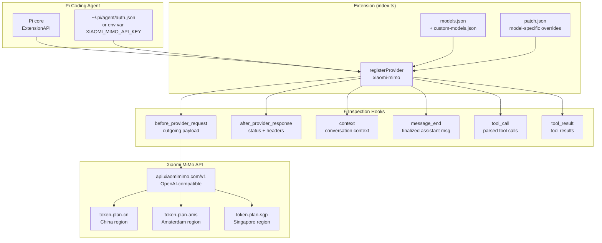
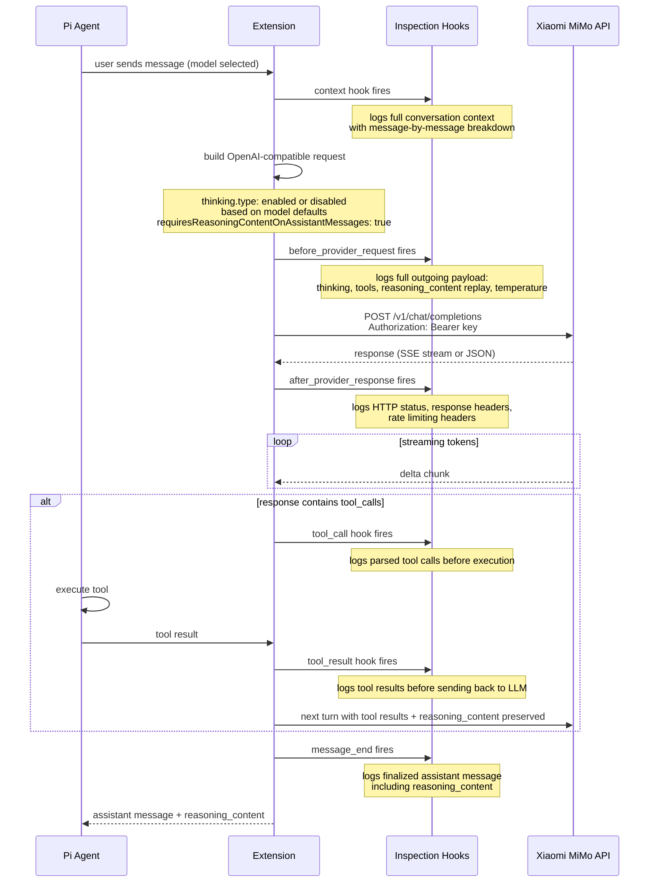
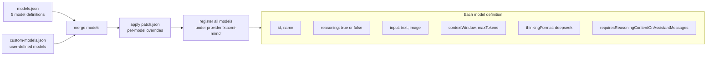
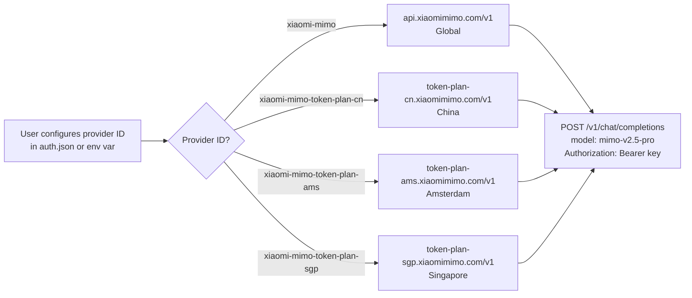

# pi-xiaomi-mimo-provider — Architecture

> A Pi plugin that registers Xiaomi MiMo models as a custom provider using an OpenAI-compatible API. Features DeepSeek-style thinking (`reasoning_content`), multi-turn reasoning preservation, and 6 inspection hooks that log the full data flow between Pi and Xiaomi's vLLM backend.

| | |
|---|---|
| **Language** | TypeScript · ES Modules |
| **Runtime** | Pi coding agent (in-process extension) |
| **API** | OpenAI-compatible at `https://api.xiaomimimo.com/v1` |
| **Models** | MiMo-V2-Flash, MiMo-V2.5, MiMo-V2.5-Pro (+ 2 legacy) |
| **Thinking** | DeepSeek-style — `thinking.type: enabled` returns `reasoning_content` |
| **Hooks** | 6 lifecycle hooks for full payload inspection |

---

## High-Level Architecture



---

## Request Lifecycle with Hooks



---

## Model Resolution

Models are loaded from two JSON files and merged. `patch.json` applies per-model overrides.



---

## Thinking / Reasoning Flow

All MiMo reasoning models use DeepSeek-style thinking. The `reasoning_content` field is preserved across multi-turn conversations for best performance.

```mermaid
flowchart TD
  REQ["User message"] --> CHECK{"Model thinking<br/>default?"}
  CHECK -- "mimo-v2-flash (OFF)" --> DISABLED["thinking.type: disabled<br/>unless user enables"]
  CHECK -- "mimo-v2.5 or v2.5-pro (ON)" --> ENABLED["thinking.type: enabled"]

  DISABLED --> API1["POST /v1/chat/completions<br/>no reasoning_content"]
  ENABLED --> API2["POST /v1/chat/completions<br/>with thinking enabled"]

  API1 --> RESP1["Standard assistant response"]
  API2 --> RESP2["Assistant response +<br/>reasoning_content field"]

  RESP2 --> PRESERVE["requiresReasoningContentOnAssistantMessages: true"]
  PRESERVE --> MULTITURN["Next turn: previous reasoning_content<br/>replayed in messages array"]
  MULTITURN --> API2

  note right of PRESERVE
    Xiaomi docs: keep all previous
    reasoning_content in messages for
    each subsequent request to achieve
    best multi-turn performance
  end note
```

---

## Multi-Region Endpoint Routing



---

## API Quirks and Compatibility

| Quirk | Handling |
|---|---|
| `tool_choice` only supports `"auto"` | Other values silently dropped server-side — plugin passes through |
| Thinking mode overrides `temperature` and `top_p` | Pro and Omni models forced to `1.0` and `0.95` by server |
| Uses `max_completion_tokens` (not `max_tokens`) | Plugin maps this in the request |
| Supports `developer` role (unlike many vLLM deployments) | Passed through natively |
| `reasoning_content` (not `reasoning`) | Pi checks `reasoning_content` first — handled correctly |
| Legacy models auto-route to V2.5 | `mimo-v2-pro` routes to `mimo-v2.5-pro`, `mimo-v2-omni` routes to `mimo-v2.5` |
